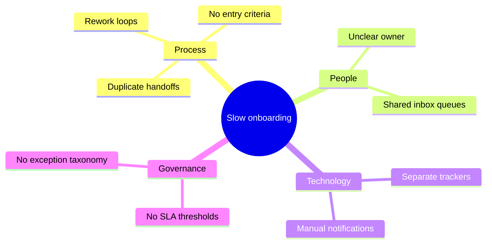
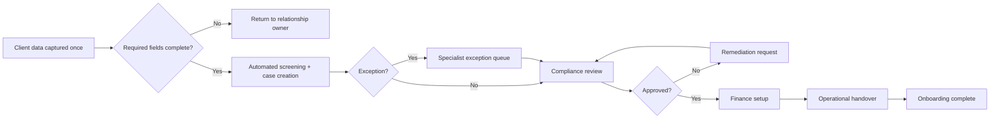

# End-to-End BPMN Process Redesign & Implementation Guide

A process-improvement case study showing **As-Is analysis, root-cause diagnosis, To-Be redesign, BPMN 2.0 modelling, control design and implementation planning**.

## Case study: Client Onboarding & Compliance Workflow

The synthetic organization has a fragmented onboarding process involving Sales, Operations, Compliance and Finance. Handoffs occur through email, ownership is unclear, evidence is requested multiple times and incomplete cases wait in shared inboxes.

## Business problem

Baseline assumptions for the synthetic case:

- 9 handoffs across 4 functions
- repeated data entry into 3 trackers
- no common definition of “ready for compliance review”
- delayed exception routing
- limited visibility of case age and owner

## Root-cause summary

## To-Be design

## Improvement hypothesis

The redesign removes duplicate intake, introduces clear entry criteria, creates one case owner and routes exceptions explicitly. A reasonable pilot would test whether median cycle time, rework rate and unowned queue time improve; projected gains in this repository are hypotheses, not claimed production results.

## Contents

- `bpmn/as-is-client-onboarding.bpmn` — BPMN 2.0 XML
- `bpmn/to-be-client-onboarding.bpmn` — BPMN 2.0 XML
- `docs/root-cause-analysis.md` — 5 Whys and cause categories
- `docs/control-plan.md` — controls, KPIs and ownership
- `docs/implementation-roadmap.md` — phased rollout plan
- `docs/measurement-plan.md` — baseline and post-change metrics

## What this demonstrates

- BPMN 2.0 modelling
- As-Is / To-Be analysis
- handoff and bottleneck identification
- root-cause analysis
- process controls
- automation opportunity identification
- change implementation planning
- business-oriented measurement
